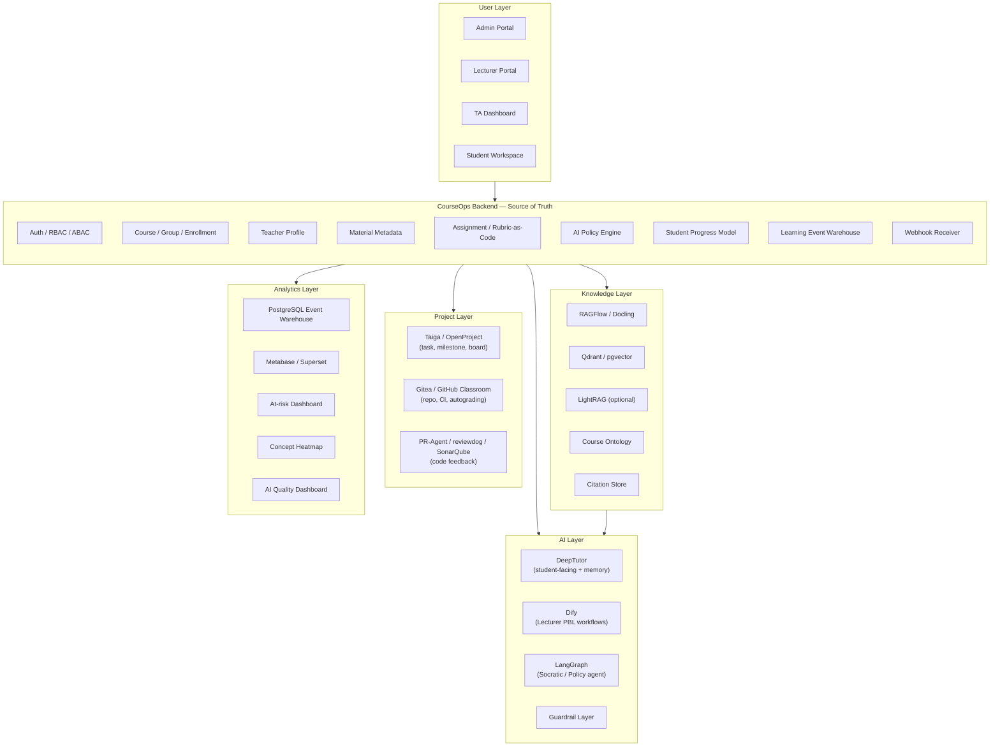

# Survey & Kiến trúc đề xuất: AI Teaching Assistant Platform cho Project-Based Learning và Socratic Progress Monitoring

---

## 1. Tóm tắt 

Hệ thống cần giải quyết hai trục chính:

### Trục giảng viên

Giảng viên cần một **Lecturer PBL Design Studio** để chuyển đổi tài liệu tĩnh thành hoạt động học tập theo mô hình Project-Based Learning:

```text
Slide / giáo trình / đề cương / chuẩn đầu ra
→ phân tích concept
→ sinh case study
→ sinh câu hỏi thảo luận
→ sinh mini-project
→ sinh milestone
→ sinh rubric
→ tùy biến theo mục tiêu và phong cách từng giảng viên
```

### Trục sinh viên

Sinh viên cần một **Student Socratic Tutor** có khả năng cá nhân hóa, lưu tiến độ và hướng dẫn theo context thực tế:

```text
Sinh viên thuộc course/group
→ nhận tài liệu và assignment tương ứng
→ làm project / push code / cập nhật task
→ hệ thống lưu progress
→ AI đọc context môn học + progress + rubric + lỗi hiện tại
→ phản hồi kiểu Socratic, không làm hộ
```

### Kiến trúc

Không có một công cụ open-source đơn lẻ nào giải quyết trọn vẹn bài toán. Phương án tốt nhất là kiến trúc kết hợp của nhiều open source 

---

## 2. Bài toán và yêu cầu hệ thống

### 2.1 Vấn đề thực tế

Trong các môn học theo hướng project-based learning, giảng viên thường gặp ba khó khăn:

1. **Thiết kế hoạt động PBL tốn thời gian**  
   Từ slide/giáo trình để tạo case study, mini-project, milestone, rubric là công việc khó, nhất là khi phải phù hợp với chuẩn đầu ra, mức độ lớp học và phong cách giảng viên.

2. **Khó theo dõi tiến độ sinh viên theo thời gian thực**  
   Trong project nhóm, giảng viên/TA khó biết nhóm nào đang chậm, sinh viên nào không đóng góp, test nào fail lặp lại, hay concept nào cả lớp đang yếu.

3. **AI generic như ChatGPT/Claude không đủ an toàn sư phạm**  
   AI tổng quát có thể trả lời hay, nhưng không biết assignment nào đang tính điểm, rubric của giảng viên là gì, sinh viên đã nhận hint mấy lần, và khi nào cần Socratic hint thay vì đưa lời giải.

### 2.2 Yêu cầu chức năng chính

| Nhóm nhu cầu | Mô tả | Thành phần hệ thống cần có |
|---|---|---|
| Thiết kế PBL | Sinh case study, discussion task, mini-project, rubric từ tài liệu giảng viên | Lecturer PBL Design Studio |
| Cá nhân hóa sinh viên | Lưu progress, điểm yếu, lịch sử hint, learner profile | DeepTutor / Student Profile |
| Hỏi đáp tài liệu chính xác | Trả lời dựa trên slide/giáo trình, có citation | RAGFlow / Qdrant / Course-aware RAG |
| Quản lý lớp và nhóm | Sinh viên thuộc course/group, có quyền truy cập tài liệu tương ứng | CourseOps Backend |
| Giám sát project | Theo dõi task, milestone, nhóm, trạng thái blocked/done | Taiga / OpenProject / custom task module |
| Giám sát code | Theo dõi commit, test fail, PR, feedback | Gitea/GitHub Classroom + CI |
| Ngăn AI làm hộ | Bài graded chỉ cho hint, không cho full solution | Policy Engine + Guardrails |
| Dashboard giảng viên | Xem lớp đang stuck ở đâu, sinh viên/nhóm nào cần can thiệp | Metabase / Superset |

---

## 3. Tiêu chí khảo sát giải pháp

Các giải pháp được đánh giá theo 8 tiêu chí:

| Tiêu chí | Câu hỏi đánh giá |
|---|---|
| Phù hợp sư phạm | Có hỗ trợ Socratic, scaffolding, tránh làm hộ không? |
| Bám context môn học | Có dùng course materials, learning objectives, rubric không? |
| Cá nhân hóa | Có lưu learner profile, progress, memory không? |
| Hỗ trợ PBL | Có hỗ trợ case study, project, milestone, rubric không? |
| Tích hợp workflow thật | Có nối được với IDE, Git, task board, LMS, dashboard không? |
| Open-source/khả thi | Có thể self-host, chỉnh sửa, triển khai MVP không? |
| Khả năng mở rộng | Có hỗ trợ nhiều course/group/user không? |
| Khả năng đánh giá | Có thể đo groundedness, citation, pedagogical compliance, learning progress không? |

---

## 4. Survey các nhóm giải pháp liên quan

## 4.1 Nhóm AI Teaching Assistant / AI Tutor

### 4.1.1 CS50.ai / CS50 Duck

**Bản chất:**  
CS50.ai là một AI trợ giảng được xây cho khóa CS50. Paper “Teaching CS50 with AI” mô tả AI hỗ trợ giải thích code, cải thiện code style, và trả lời câu hỏi curricular/administrative trong khóa học CS50. CS50.ai cũng được tích hợp vào Visual Studio Code for CS50 tại cs50.dev.

**Điểm đáng học:**

- AI phải được “course-wrapped”, tức có lớp backend/prompt/policy riêng cho môn học.
- AI nên hỗ trợ sinh viên liên tục nhưng không thay giảng viên.
- AI nên được tích hợp vào workflow học thật: IDE, forum, assignment.
- AI cần guardrails để tránh đưa lời giải trực tiếp.

**Giới hạn:**

- CS50.ai là hệ thống phục vụ nội bộ, không phải open-source platform cho trường khác triển khai trực tiếp.
- Mạnh ở code/course Q&A, nhưng chưa phải PBL Design Studio cho giảng viên.
- Chưa tập trung vào dashboard project/milestone cho nhiều nhóm sinh viên.

**Áp dụng vào dự án:**

CS50.ai nên được dùng làm case study nền tảng về **course-aware AI TA** và **guarded AI support**. Tuy nhiên, hệ thống đề xuất cần mở rộng thêm lớp lecturer workflow, task/milestone, progress dashboard và course/group management.

---

### 4.1.2 DeepTutor

**Bản chất:**  
DeepTutor là một framework open-source cho personalized tutoring. Điểm mạnh của DeepTutor là kết hợp **course knowledge grounding** với **dynamic learner memory**, từ đó xây dựng learner profile và cá nhân hóa quá trình học.

**Điểm đáng học:**

- Lưu tiến độ học tập không chỉ dưới dạng chat log, mà thành learner profile.
- Có memory động để phát hiện điểm yếu và điều chỉnh độ khó.
- Có thể dùng làm student-facing tutor core.
- Hỗ trợ hướng học cá nhân hóa thay vì chỉ trả lời câu hỏi hiện tại.


**Áp dụng vào dự án:**

DeepTutor nên được dùng làm **lõi sinh viên**:

```text
Student Tutor UI
Personalized Memory
Learner Profile
Trace-based Tutoring
Citation-grounded QA
Practice Generation
```

Nhưng phải được bọc bởi **CourseOps Backend** để thêm course, group, enrollment, teacher policy, assignment, rubric và dashboard.

---

### 4.1.3 CourseAssist

**Bản chất:**  
CourseAssist là AI tutor cho Computer Science Education. Khác với GPT-4/ChatGPT generic, CourseAssist dùng **RAG, user intent classification, question decomposition** để căn chỉnh câu trả lời với tài liệu môn học và learning objectives.

**Vấn đề CourseAssist giải quyết:**

AI tổng quát trong học lập trình có ba rủi ro:

1. Đưa code/lời giải trực tiếp, làm sinh viên phụ thuộc.
2. Giải thích không khớp với nội dung môn học.
3. Trả lời đúng chung chung nhưng lệch mục tiêu giảng viên.

**Điểm đáng học:**

```text
Student question
→ intent classification
→ question decomposition
→ course-material retrieval
→ pedagogically appropriate response
```

**Giới hạn:**

- CourseAssist gần với stateless QA tutor.
- Chưa đủ mạnh ở memory/progress dài hạn như DeepTutor.
- Chưa đọc được project task, Git commit, test log như một hệ project monitoring.

**Áp dụng vào dự án:**

CourseAssist nên được kế thừa ở phần:

- Intent classifier.
- Question decomposition.
- Evaluation theo usefulness, accuracy, pedagogical appropriateness.
- Router phân biệt: theory question, assignment question, debugging question, direct solution request, project planning question.

---

### 4.1.4 Iris / Artemis

**Bản chất:**  
Iris là AI virtual tutor tích hợp trong nền tảng Artemis cho các bài lập trình. Iris có contextual awareness vì đọc được problem statement, student code và automated feedback.

**Điểm đáng học:**

- AI không chỉ nhận câu hỏi, mà còn đọc được trạng thái bài làm.
- AI dùng problem statement + code + test feedback để đưa hint cá nhân hóa.
- AI tránh tiết lộ complete solution, dùng subtle hints hoặc counter-questions.

**Áp dụng vào dự án:**

Iris là reference rất sát cho module:

```text
Git/Gitea/GitHub Classroom
→ CI test log
→ commit diff
→ assignment requirement
→ rubric
→ Student Socratic Coach
```

---

## 4.2 Nhóm Document Understanding & RAG

### 4.2.1 RAGFlow

**Bản chất:**  
RAGFlow là open-source RAG engine dựa trên deep document understanding. Nó phù hợp với tài liệu có format phức tạp và cần câu trả lời có citation.

**Điểm đáng học:**

- Parse PDF/slide/tài liệu phức tạp.
- Tạo chunk có citation.
- Cho phép can thiệp vào file parsing.
- Hỗ trợ tạo dataset/knowledge base phục vụ QA.

**Áp dụng vào dự án:**

RAGFlow nên làm **Course Knowledge Ingestion Layer**:

```text
Giảng viên upload slide/PDF/giáo trình
→ RAGFlow parse
→ chunk + citation + metadata
→ lưu vào Qdrant/pgvector
→ DeepTutor/Dify/LangGraph sử dụng context
```

**Khi nào cần RAGFlow?**

- Slide nhiều hình, bảng, layout phức tạp.
- PDF scan hoặc giáo trình dài.
- Cần citation chính xác.
- Cần tách tài liệu theo week/topic/section.

---

### 4.2.2 LightRAG

**Bản chất:**  
LightRAG dùng graph structures trong indexing và retrieval, giúp lấy cả thông tin low-level và high-level thay vì chỉ chunk phẳng.

**Điểm đáng học:**

- Không chỉ lưu văn bản thành chunk rời rạc.
- Trích xuất concept, entity, relation.
- Truy vết prerequisite giữa các khái niệm.
- Hữu ích khi sinh viên fail một test liên quan tới concept tiền đề.

**Áp dụng vào dự án:**

LightRAG nên là **bản nâng cấp sau RAGFlow**:

```text
Slide tuần 4: vòng lặp
Slide tuần 5: recursion
Assignment fail: base case recursion
→ truy ngược graph:
   recursion → condition → stopping condition → loop invariant
```

Trong MVP, có thể chưa cần LightRAG ngay. Nhưng nếu muốn hệ thống có khả năng giải thích sâu theo concept progression, nên đưa LightRAG vào roadmap nâng cao.

---

### 4.2.3 Qdrant / pgvector

**Vai trò:**  
Lưu embedding và metadata để retrieval theo course/group/role.

**Khuyến nghị:**

- Dùng **pgvector** nếu MVP nhỏ, muốn đơn giản deployment.
- Dùng **Qdrant** nếu cần metadata filtering mạnh và production retrieval tốt hơn.

**Metadata filter bắt buộc:**

```json
{
  "course_id": "CS101",
  "visibility": "student_visible",
  "group_id": "G03"
}
```

Không được để sinh viên search toàn bộ vector database vì có nguy cơ rò rỉ tài liệu/solution của môn khác hoặc nhóm khác.

---

## 4.3 Nhóm Workflow / Agent Orchestration

### 4.3.1 Dify

**Bản chất:**  
Dify là open-source LLM app development platform, có AI workflow, RAG pipeline, agent capabilities, model management và observability.

**Phù hợp với:**

- Lecturer workflow.
- Slide-to-case.
- Syllabus-to-project.
- Rubric generation.
- Course Q&A bot prototype.
- Prompt testing và workflow debugging cho giảng viên/nhóm phát triển.

**Không nên dùng Dify làm:**

- Source of truth cho student progress.
- Hệ thống quản lý course/group/enrollment.
- Analytics warehouse.
- Student Socratic Agent phức tạp có vòng lặp stateful.

**Áp dụng vào dự án:**

```text
Lecturer-side workflow → Dify
Student-side stateful agent → LangGraph / DeepTutor
```

---

### 4.3.2 LangGraph

**Bản chất:**  
LangGraph là framework cho long-running, stateful agents/workflows. Nó phù hợp khi agent cần lưu state, rẽ nhánh, vòng lặp, kiểm tra compliance và cập nhật learner profile.

**Phù hợp với Student Socratic Coach:**

```text
retrieve
→ generate
→ judge
→ rewrite
→ ask follow-up
→ update profile
```

**Áp dụng vào dự án:**

LangGraph nên dùng cho phần cần kiểm soát logic chi tiết:

```text
IntentClassifierNode
ContextRetrieverNode
SocraticGeneratorNode
ComplianceJudgeNode
OutputRewriterNode
MemoryUpdateNode
```

Nếu dùng DeepTutor làm student core, LangGraph có thể dùng như lớp tích hợp/nâng cấp để nối student state, assignment policy và Git/test events.

---

### 4.3.3 Open WebUI

**Bản chất:**  
Open WebUI là self-hosted AI interface, hỗ trợ local/cloud model và có RAG interface.

**Vai trò phù hợp:**

- UI phụ cho thử nghiệm local model.
- Admin/dev console để kiểm tra model.

**Giới hạn:**

- Không giải quyết course/group/RBAC sâu.
- Không quản lý assignment/rubric/policy.
- Không quản lý project/milestone và student progress.

---

## 4.4 Nhóm Project & Milestone Management

### 4.4.1 OpenProject

**Bản chất:**  
OpenProject là open-source project management software, hỗ trợ work packages, task, milestone, Gantt/timeline, collaboration, wiki/forum, bug tracking và agile workflows.

**Điểm đáng học:**

- Work package.
- Milestone.
- Gantt/timeline.
- Wiki/forum theo project.
- Role trong project.
- Theo dõi tiến độ nhóm.

**Giới hạn:**

- Hơi nặng nếu dùng cho sinh viên năm đầu hoặc mini-project ngắn.
- UI có thể phức tạp nếu chỉ cần task board cơ bản.

**Áp dụng vào dự án:**

OpenProject phù hợp nếu hệ thống triển khai cho project lớn, nhiều milestone, nhiều nhóm, cần Gantt và quản trị nghiêm túc. Với MVP, có thể học data model của OpenProject và build task/milestone nhẹ hơn.

---

### 4.4.2 Taiga

**Bản chất:**  
Taiga là open-source agile project management tool, hỗ trợ Scrum/Kanban, backlog, sprint, user stories, epics.

**Điểm đáng học:**

- Kanban board trực quan.
- Scrum/backlog/sprint.
- Phù hợp với nhóm sinh viên làm project ngắn.
- Nhẹ hơn OpenProject.

**Áp dụng vào dự án:**

Taiga phù hợp hơn cho MVP nếu cần project board nhanh:

```text
Todo → Doing → Review → Done
```

AI có thể đọc task status để phát hiện nhóm/sinh viên bị stuck.

---

## 4.5 Nhóm Code / Git / Autograding

### 4.5.1 Gitea / GitHub Classroom

**Gitea:**  
Gitea là self-hosted all-in-one software development service, bao gồm Git hosting, code review, team collaboration, package registry và CI/CD. Gitea Actions có workflow syntax gần với GitHub Actions.

**GitHub Classroom:**  
Phù hợp nếu muốn triển khai nhanh trong môi trường giáo dục, có autograding chạy test khi sinh viên push code.

**Khuyến nghị:**

| Trường hợp | Công cụ nên dùng |
|---|---|
| Cần pilot nhanh | GitHub Classroom + GitHub Actions |
| Cần self-host/open-source | Gitea + Gitea Actions |
| Trường đã dùng GitLab | GitLab CE + CI |

### 4.5.2 PR-Agent / reviewdog / SonarQube

| Công cụ | Vai trò |
|---|---|
| PR-Agent | AI mentor review, feedback mềm theo rubric |
| reviewdog | Comment từ linter/test/static analyzer lên PR |
| SonarQube | Code quality/security/static analysis |
| LLM | Không chấm chính; chỉ giải thích và hướng dẫn |

**Nguyên tắc quan trọng:**  
Không dùng LLM làm nguồn chấm điểm chính. Điểm chính nên dựa trên tests, rubric, static analysis và human/TA override.

---

## 4.6 Nhóm Learning Analytics

### 4.6.1 Metabase

Metabase là open-source business intelligence platform, dùng để hỏi dữ liệu, tạo dashboard và embed dashboard vào ứng dụng.

**Phù hợp với:**

- Course overview.
- Project monitoring.
- Concept heatmap.
- At-risk student dashboard.
- AI quality dashboard.

### 4.6.2 Superset

Superset phù hợp hơn khi cần dashboard/BI phức tạp hơn, nhiều dữ liệu hơn, truy vấn SQL sâu hơn. MVP nên dùng Metabase vì dễ triển khai và dễ cho giảng viên sử dụng hơn.

---

## 5. Bảng tổng hợp bài học rút ra

| Bài học | Nguồn tham khảo | Áp dụng vào hệ thống |
|---|---|---|
| AI phải bám context môn học | CS50.ai, CourseAssist | Course-aware RAG, metadata filtering |
| AI cần memory/progress cá nhân | DeepTutor | Learner profile, trace memory |
| Tài liệu cần citation đáng tin | RAGFlow | Chunking + citation store |
| Không nên chỉ dùng chunk phẳng | LightRAG | Concept graph, prerequisite tracing |
| Giảng viên cần workflow riêng | Dify | Lecturer PBL Design Studio |
| Student coach cần stateful loop | LangGraph | Socratic Agent |
| PBL cần task/milestone | OpenProject/Taiga | Project board, milestone tracking |
| Code progress cần CI/test log | Gitea/GitHub Classroom | Student progress monitoring |
| AI không được làm hộ | CS50.ai, CourseAssist, Iris | Policy Engine, Guardrails |
| Dashboard phải phục vụ can thiệp | Metabase/Superset | At-risk dashboard, concept heatmap |

---

## 6. Khoảng trống của các giải pháp hiện có

Qua khảo sát, có thể thấy mỗi hệ thống mạnh ở một phần nhưng chưa giải quyết toàn bộ bài toán:

| Hệ thống | Mạnh ở đâu | Thiếu gì so với bài toán |
|---|---|---|
| CS50.ai | Course-aware AI, code explanation, policy QA | Chưa có PBL Design Studio và project dashboard |
| DeepTutor | Personalized tutor, memory, learner profile | Thiếu course/group/RBAC, lecturer workflow, Git/project integration |
| CourseAssist | Intent classification, question decomposition, course-aligned QA | Thiếu long-term progress và project monitoring |
| Iris | Context-aware programming tutor | Tập trung code exercise, không phải PBL platform đầy đủ |
| RAGFlow | Document parsing, citation, QA | Không quản lý course/project/student progress |
| Dify | Workflow/RAG nhanh cho lecturer | Không nên làm source of truth cho progress/policy |
| OpenProject/Taiga | Project/task/milestone | Không có AI tutor/RAG |
| Gitea/GitHub | Code repo, CI, autograding | Không có pedagogical intelligence |
| Metabase | Dashboard | Cần event warehouse đầu vào |

Kết luận: cần một kiến trúc lai, trong đó mỗi công cụ đảm nhiệm đúng vai trò chuyên môn.

---

## 7. Kiến trúc đề xuất: Hybrid CourseOps AI-TA

### 7.1 Nguyên tắc thiết kế

1. **Custom CourseOps Backend là source of truth**  
   Không để Dify, DeepTutor hay project board lưu độc quyền dữ liệu giáo dục quan trọng.

2. **DeepTutor dùng cho student-facing tutor**  
   Không build lại student tutor từ đầu nếu có thể fork/tích hợp DeepTutor.

3. **RAGFlow dùng cho document layer**  
   Giảng viên upload tài liệu chính thức; RAGFlow parse/chunk/citation.

4. **Dify dùng cho lecturer workflow**  
   Dify phù hợp cho workflow sinh case study, mini-project, rubric.

5. **LangGraph dùng cho stateful Socratic logic**  
   Nếu cần agent kiểm soát nhiều bước, dùng LangGraph hoặc mở rộng DeepTutor bằng logic tương đương.

6. **OpenProject/Taiga dùng cho project/milestone**  
   AI không thể giám sát tiến độ nếu không có task/milestone/task status.

7. **Gitea/GitHub dùng cho code progress**  
   Với môn lập trình, commit/test log là evidence quan trọng nhất.

8. **Metabase/Superset dùng cho analytics**  
   Dashboard phải đọc từ event warehouse riêng, không phụ thuộc trực tiếp vào DB nội bộ của Dify/DeepTutor.

---

### 7.2 Sơ đồ kiến trúc



---

## 8. Thiết kế các module chính

## 8.1 Module 1 — CourseOps Backend

### Mục tiêu

Quản lý toàn bộ dữ liệu giáo dục cốt lõi: user, role, course, group, enrollment, material, assignment, rubric, policy, progress, event.

### Thành phần

```text
users
roles
courses
course_groups
enrollments
teacher_profiles
materials
assignments
rubrics
ai_policies
student_profiles
learning_events
```

### Vì sao cần?

DeepTutor/Dify/RAGFlow không thay thế được lớp này. Nếu không có CourseOps Backend, hệ thống không thể biết:

- Sinh viên nào thuộc môn nào.
- Ai được xem tài liệu nào.
- Assignment nào là graded.
- Rubric nào áp dụng cho bài nào.
- AI được phép hỗ trợ tới mức nào.
- Dashboard lấy dữ liệu từ đâu.

---

## 8.2 Module 2 — Lecturer PBL Design Studio

### Mục tiêu

Hỗ trợ giảng viên chuyển tài liệu môn học thành hoạt động PBL có cấu trúc.

### Input

```text
slide bài giảng
giáo trình
syllabus
chuẩn đầu ra
teacher profile
mức độ lớp học
thời lượng project
ràng buộc công nghệ
```

### Processing

```text
extract concept
→ map learning objectives
→ map Bloom/CDIO
→ generate case study
→ generate discussion questions
→ generate mini-project
→ generate rubric
→ lecturer review
→ publish
```

### Output

```text
PBL lesson pack
case study
discussion questions
mini-project
milestone
rubric
student instruction
teacher note
assessment plan
```

### Tiêu chuẩn kiểm tra PBL

Theo Gold Standard PBL, output cần có:

- Challenging problem/question.
- Sustained inquiry.
- Authenticity.
- Student voice & choice.
- Reflection.
- Critique & revision.
- Public product.

### Công nghệ

```text
Dify workflow
RAGFlow course knowledge
Teacher Profile
Rubric-as-Code
```

---

## 8.3 Module 3 — Course Knowledge Layer

### Mục tiêu

Biến tài liệu giảng viên upload thành knowledge base có citation, metadata và quyền truy cập rõ ràng.

### Pipeline

```text
Upload tài liệu
→ parse bằng RAGFlow/Docling
→ extract text/table/image
→ chunk theo section/slide/topic
→ gắn metadata
→ tạo citation
→ embedding
→ lưu Qdrant/pgvector
→ optional: build concept graph bằng LightRAG
```

### Metadata bắt buộc

```yaml
chunk:
  course_id:
  group_id:
  material_id:
  material_type: slide | textbook | syllabus | rubric | assignment | faq
  week:
  topic:
  concept_ids:
  bloom_level:
  visibility: student_visible | teacher_only | ta_only
  source_page:
  section_title:
  citation:
```

### Retrieval policy

```text
Student query:
- filter course_id
- filter group_id nếu tài liệu riêng nhóm
- visibility = student_visible
- không retrieve teacher_only solution

Lecturer query:
- retrieve cả teacher notes, solution, rubric

TA query:
- retrieve tài liệu + progress + selected logs
```

---

## 8.4 Module 4 — Student Tutor Layer

### Mục tiêu

Dùng DeepTutor làm nền cho student-facing tutor để tránh build lại từ đầu.

### DeepTutor đảm nhiệm

```text
Student chat
Personalized memory
Learner profile
Trace-based tutoring
Citation-grounded QA
Practice/quiz generation
```

### Phần cần bọc thêm

```text
Course enrollment
Group membership
Assignment policy
Rubric
Teacher profile
Progress sync
Dashboard event logging
```

### Kết luận

DeepTutor nên là **student tutor core**, nhưng không nên là toàn bộ hệ thống.

---

## 8.5 Module 5 — Student Socratic Coach

### Mục tiêu

Hướng dẫn sinh viên theo kiểu Socratic dựa trên context môn học, assignment, rubric, progress và test log.

### Agent pipeline

```text
Student question
→ load student profile
→ load assignment policy
→ classify intent
→ decompose question
→ retrieve course context
→ retrieve progress/test log/task status
→ generate Socratic response
→ compliance check
→ update trace memory
→ log learning event
```

### Hint ladder

| Level | Loại hỗ trợ | Khi dùng |
|---|---|---|
| 0 | Hỏi phản tư | Khi sinh viên hỏi quá chung |
| 1 | Gợi ý concept | Bài graded, hint đầu tiên |
| 2 | Chỉ vùng lỗi logic | Bài graded, sau khi đã thử |
| 3 | Pseudo-code ngắn | Practice hoặc lecturer cho phép |
| 4 | Worked example tương tự | Practice mode |
| 5 | Full solution | Chỉ lecturer/teacher-only |

### Công nghệ

```text
DeepTutor memory
CourseAssist-style intent classifier
LangGraph stateful loop
Policy Engine
Guardrails
```

---

## 8.6 Module 6 — Project / Milestone Management

### Mục tiêu

Theo dõi project theo nhóm: task, milestone, blocked status, contribution.

### Option

| Option | Ưu điểm | Nhược điểm | Khuyến nghị |
|---|---|---|---|
| Taiga | Nhẹ, Kanban/Scrum, dễ dùng | Ít tính năng enterprise hơn | Hợp MVP |
| OpenProject | Mạnh, Gantt/wiki/forum/time tracking | Hơi nặng với sinh viên | Hợp project lớn |
| Custom mini-board | Gọn, tích hợp sâu | Phải build thêm | Hợp MVP nếu team dev đủ |

### Task schema tối thiểu

```yaml
project_task:
  task_id:
  course_id:
  group_id:
  assignment_id:
  title:
  status: todo | doing | blocked | review | done
  assignee:
  due_date:
  linked_concepts:
  linked_tests:
  ai_notes:
```

### AI dùng task data để phát hiện

```text
nhóm trễ milestone
task blocked quá lâu
sinh viên không đóng góp
test fail lặp lại
concept yếu theo nhóm
```

---

## 8.7 Module 7 — Code / Git / Autograding Pipeline

### Mục tiêu

Theo dõi tiến độ thực hành qua commit, test result, PR và feedback code.

### Pipeline

```text
Sinh viên nhận assignment repo
→ push code
→ CI chạy unit tests
→ test result gửi webhook về CourseOps Backend
→ progress update
→ AI đọc failing tests + commit diff
→ Socratic feedback
→ dashboard cập nhật risk
```

### Option công nghệ

| Trường hợp | Công nghệ |
|---|---|
| Pilot nhanh | GitHub Classroom + GitHub Actions |
| Self-host/open-source | Gitea + Gitea Actions |
| Trường dùng GitLab | GitLab CE + CI |

### Code feedback

```text
PR-Agent: feedback mềm, mentor review
reviewdog: comment từ linter/test/static analyzer
SonarQube: code quality/security/static analysis
LLM: không chấm chính, chỉ giải thích và hướng dẫn
```

---

## 8.8 Module 8 — Guardrails & Policy Engine

### Mục tiêu

Đảm bảo AI hỗ trợ đúng mức, không làm hộ sinh viên, không rò rỉ teacher-only solution.

### Policy matrix

```yaml
policy:
  graded_assignment:
    allow_full_solution: false
    max_hint_level: 2
    allow_code_block: false
    require_socratic_question: true

  practice_assignment:
    allow_full_solution: false
    max_hint_level: 4
    allow_example_code: true

  lecturer_mode:
    allow_full_solution: true
    allow_rubric_generation: true

  exam_context:
    allow_full_solution: false
    max_hint_level: 1
    escalate_if_suspicious: true
```

### Guardrail pipeline

```text
Input classifier
→ policy resolver
→ generator
→ compliance judge
→ output rewriter
→ event logger
```

### Lưu ý về throttling

Có thể áp dụng throttling/adaptive friction để tránh spam hoặc xin lời giải liên tục. Tuy nhiên, không nên copy cứng một cơ chế như “10 hearts” nếu chưa có thực nghiệm riêng. Nên bắt đầu bằng rule mềm:

```text
- cảnh báo nếu direct_solution_request lặp lại
- giới hạn hint level trong bài graded
- escalate cho TA nếu sinh viên stuck quá lâu
```

---

## 8.9 Module 9 — Learning Analytics Dashboard

### Mục tiêu

Giúp giảng viên/TA biết lớp đang mắc ở đâu và cần can thiệp vào nhóm/sinh viên nào.

### Event schema vd

```sql
CREATE TABLE courseops_learning_events (
    event_id UUID PRIMARY KEY,
    event_type VARCHAR(50) NOT NULL,
    student_id VARCHAR(50),
    course_id VARCHAR(50),
    group_id VARCHAR(50),
    assignment_id VARCHAR(50),
    concept_ids TEXT[],
    payload JSONB NOT NULL,
    created_at TIMESTAMP WITH TIME ZONE
);
```

### Event types

```text
student.question_asked
ai.answer_generated
ai.policy_violation_detected
student.task_blocked
student.task_completed
student.commit_pushed
student.test_failed
student.test_passed
student.pr_opened
ta.escalation_resolved
teacher.feedback_approved
```

### Dashboard chính

| Dashboard | Chỉ số |
|---|---|
| Course Overview | active students, active groups, assignment completion |
| Project Monitoring | milestone progress, blocked tasks, group contribution |
| Concept Heatmap | weak concepts, repeated questions, failing tests by concept |
| AI Quality | citation coverage, violation rate, teacher correction rate |
| At-risk Students | no commit for N days, repeated same test failure, high hint usage |

---

## 9. Bảng dùng sẵn / build mới

| Thành phần | Dùng sẵn / Build? | Công nghệ | Lý do |
|---|---|---|---|
| Student Tutor UI | Dùng sẵn/fork | DeepTutor | Có memory, learner profile, tutor cá nhân hóa |
| Personalized Memory | Dùng sẵn/fork | DeepTutor | Tránh build lại learner profile từ đầu |
| Document QA | Dùng sẵn | RAGFlow | Tốt cho tài liệu khó, citation |
| Course Knowledge Store | Build/tích hợp | Qdrant/pgvector | Cần metadata filtering |
| Lecturer Workflow | Build trên tool | Dify | Dễ tạo slide-to-project, rubric generator |
| Stateful Student Coach | Build/tích hợp | DeepTutor + LangGraph | Cần policy, loop, progress update |
| Course Management | Build mới | FastAPI/NestJS + PostgreSQL | DeepTutor không đủ RBAC/course/group |
| Assignment/Rubric/Policy | Build mới | Backend riêng | Đây là lõi sư phạm |
| Project Management | Tích hợp/build nhẹ | Taiga/OpenProject | Quản lý task/milestone |
| Code Progress | Tích hợp | Gitea/GitHub + CI | Theo dõi commit/test |
| Code Feedback | Tích hợp | PR-Agent/reviewdog/SonarQube | Feedback code theo rubric |
| Dashboard | Tích hợp | Metabase/Superset | Giảng viên xem progress |

---

## 10. Roadmap triển khai đề xuất

## Phase 0 — Research & Design, 2 tuần

```text
- Chọn 1 môn pilot
- Thu thập slide, syllabus, assignment, rubric cũ
- Phỏng vấn giảng viên về phong cách dạy
- Thiết kế teacher profile schema
- Thiết kế rubric-as-code schema
- Thiết kế policy matrix
- Thiết kế evaluation dataset ban đầu
```

## Phase 1 — CourseOps Foundation, 3–4 tuần

```text
- Build backend: user, role, course, group, enrollment
- Build material management
- Build assignment/rubric/policy APIs
- Build event warehouse schema
- Tích hợp auth và permission
```

## Phase 2 — Knowledge Layer, 3–4 tuần

```text
- Triển khai RAGFlow
- Ingest tài liệu có metadata
- Lưu Qdrant/pgvector
- Thiết lập citation
- Test retrieval theo course/group/visibility
```

## Phase 3 — Lecturer PBL Studio, 3–4 tuần

```text
- Dify workflow:
  slide-to-concept
  concept-to-case
  syllabus-to-project
  project-to-rubric
  rubric-to-milestone
- Lecturer review loop
- Publish lesson pack
```

## Phase 4 — Student Tutor Integration, 4–5 tuần

```text
- Fork/tích hợp DeepTutor
- Nối DeepTutor với CourseOps Backend
- Load course knowledge theo enrollment
- Load student profile
- Log learning events
```

## Phase 5 — Socratic Coach & Guardrails, 4–5 tuần

```text
- Intent classification
- Question decomposition
- Policy resolver
- Hint ladder
- Compliance judge
- Output rewriter
- Full-solution leakage tests
```

## Phase 6 — Project/Code Pipeline, 3–4 tuần

```text
- Tích hợp Taiga/OpenProject hoặc custom board
- Tích hợp Gitea/GitHub Classroom
- CI test logs
- Webhook receiver
- PR-Agent/reviewdog/SonarQube
```

## Phase 7 — Dashboard & Pilot, 3–4 tuần

```text
- Metabase dashboard
- Concept heatmap
- At-risk student dashboard
- AI quality dashboard
- Pilot 30–50 sinh viên
- Thu feedback giảng viên/sinh viên
```

### Ghi chú thời gian

- **8 tuần** phù hợp cho PoC.
- **14–20 tuần** phù hợp hơn cho MVP vận hành thật.
- Nếu  dùng DeepTutor làm student core, thời gian build student UI giảm, nhưng thời gian tích hợp CourseOps/permission/progress vẫn cần tính

---

## 11. Evaluation Harness

Cần evaluation theo 4 nhóm.

### 11.1 RAG Evaluation

| Metric | Ý nghĩa |
|---|---|
| Retrieval Recall@k | Có retrieve đúng nguồn không? |
| Citation Accuracy | Citation có đúng slide/trang không? |
| Groundedness | Câu trả lời có bám tài liệu không? |
| No-answer Accuracy | Khi không có nguồn, AI có biết từ chối không? |

### 11.2 Pedagogical Evaluation

| Metric | Ý nghĩa |
|---|---|
| Socratic-first Rate | AI có hỏi/gợi mở trước không? |
| Full-solution Leakage Rate | AI có lỡ đưa lời giải/code không? |
| Hint-level Compliance | AI có tuân thủ max_hint_level không? |
| Graded/Practice Routing Accuracy | Phân loại đúng bài graded/practice không? |

### 11.3 PBL Evaluation

| Metric | Ý nghĩa |
|---|---|
| Alignment với learning objectives | Project có bám mục tiêu môn học không? |
| PBLWorks Criteria Coverage | Có đủ 7 yếu tố PBL không? |
| Teacher Profile Fit | Có đúng phong cách giảng viên không? |
| Rubric Clarity | Rubric có rõ và chấm được không? |
| Teacher Edit Distance | Giảng viên phải sửa output nhiều hay ít? |

### 11.4 Progress Monitoring Evaluation

| Metric | Ý nghĩa |
|---|---|
| At-risk Detection Precision/Recall | Phát hiện đúng sinh viên/nhóm stuck không? |
| Test Pass Improvement After Hints | Hint có giúp sinh viên pass test tốt hơn không? |
| TA Intervention Effectiveness | Cảnh báo có giúp TA can thiệp đúng lúc không? |
| Student Satisfaction | Sinh viên có thấy AI hữu ích nhưng không làm hộ không? |

---

## 12. Rủi ro và hướng xử lý

| Rủi ro | Mô tả | Hướng xử lý |
|---|---|---|
| AI làm hộ sinh viên | Sinh viên xin code/lời giải trực tiếp | Policy Engine, hint ladder, compliance judge |
| RAG sai nguồn | AI cite sai slide hoặc hallucinate | Citation validation, retrieval evaluation, no-answer policy |
| Dashboard không có ý nghĩa | Chỉ đếm lượt chat, không đo học tập | Learning events, concept heatmap, stuck detection |
| Tích hợp quá nhiều tool | Hệ thống phức tạp, khó vận hành | PoC theo module, ưu tiên DeepTutor + CourseOps + RAGFlow trước |
| DeepTutor không đủ classroom-ready | Thiếu course/group/RBAC | Bọc bằng CourseOps Backend |
| PR-Agent review ồn | Comment lan man, sinh viên bỏ qua | Rubric chặt, severity limit, reviewdog/SonarQube cho lỗi deterministic |
| Chi phí LLM tăng | Nhiều lượt chat, nhiều review | Cache, model routing, local model cho tác vụ nhẹ |
| Rò rỉ tài liệu teacher-only | Student retrieve nhầm solution/rubric nội bộ | ABAC filter theo course/group/visibility |

---

## 13. Khuyến nghị kiến trúc

Phương án đề xuất:

```text
Custom CourseOps Backend
+ DeepTutor cho student tutor
+ RAGFlow/Qdrant cho knowledge layer
+ Dify cho lecturer PBL workflow
+ LangGraph cho Socratic stateful logic
+ Taiga/OpenProject cho milestone/task
+ Gitea/GitHub Classroom cho code progress
+ Metabase/Superset cho analytics
```


### Nên làm

```text
- Dùng DeepTutor để tránh build student tutor từ đầu.
- Build CourseOps Backend để quản lý lớp học thật.
- Dùng RAGFlow để xử lý tài liệu giảng viên upload.
- Dùng Dify để nhanh chóng tạo workflow cho giảng viên.
- Dùng LangGraph/guardrails để kiểm soát Student Socratic Coach.
- Dùng task/milestone + Git/CI để giám sát progress thật.
- Dùng evaluation harness trước khi pilot.
```

---

## 14. Kết luận


DeepTutor mạnh ở personalized tutoring và learner memory, nhưng cần được bọc bởi CourseOps Backend để phù hợp môi trường lớp học thật. RAGFlow mạnh ở document understanding và citation, phù hợp cho tài liệu giảng viên upload. Dify phù hợp với lecturer-side workflow như slide-to-case, syllabus-to-project và rubric generation. LangGraph phù hợp với các vòng lặp Socratic có trạng thái. OpenProject/Taiga giúp bổ sung task/milestone, còn Gitea/GitHub Classroom giúp lấy dữ liệu thực hành từ commit/test. Metabase/Superset giúp biến learning events thành dashboard can thiệp sư phạm.

Vì vậy, hướng phù hợp nhất là **Hybrid CourseOps AI-TA Architecture**: một nền tảng trong đó AI không hoạt động như chatbot rời rạc, mà được đặt trong hệ thống quản lý môn học, nhóm sinh viên, tài liệu, assignment, rubric, policy, progress và analytics.


---

## Tài liệu tham khảo

1. CS50.ai / Teaching CS50 with AI — Harvard CS50 paper and CS50 documentation.  
   https://cs.harvard.edu/malan/publications/V1fp0567-liu.pdf  
   https://cs50.readthedocs.io/cs50.ai/

2. DeepTutor — open-source personalized AI tutor and paper.  
   https://github.com/HKUDS/DeepTutor  
   https://arxiv.org/abs/2604.26962

3. CourseAssist — Pedagogically Appropriate AI Tutor for Computer Science Education.  
   https://arxiv.org/abs/2407.10246

4. Iris — AI-driven virtual tutor for computer science education.  
   https://arxiv.org/abs/2405.08008

5. RAGFlow — open-source RAG engine based on deep document understanding.  
   https://ragflow.io/docs/  
   https://github.com/infiniflow/ragflow

6. LightRAG — graph-based retrieval augmented generation.  
   https://arxiv.org/html/2410.05779v1

7. Dify — open-source LLM app development platform.  
   https://github.com/langgenius/dify

8. LangGraph — stateful, long-running agents/workflows.  
   https://github.com/langchain-ai/langgraph

9. PBLWorks Gold Standard PBL.  
   https://www.pblworks.org/what-is-pbl/gold-standard-project-design

10. OpenProject — open-source project management software.  
    https://github.com/opf/openproject

11. Taiga — open-source agile project management.  
    https://taiga.io/

12. Gitea and Gitea Actions.  
    https://docs.gitea.com/  
    https://about.gitea.com/products/runner

13. GitHub Classroom Autograding.  
    https://docs.github.com/en/education/manage-coursework-with-github-classroom/teach-with-github-classroom/use-autograding

14. PR-Agent.  
    https://github.com/The-PR-Agent/pr-agent

15. SonarQube Pull Request Analysis.  
    https://docs.sonarsource.com/sonarqube-server/10.8/analyzing-source-code/pull-request-analysis/introduction

16. Metabase documentation.  
    https://www.metabase.com/docs/latest/
